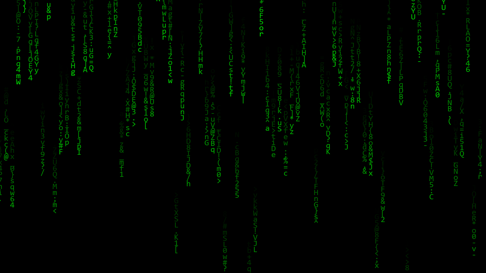

# matrix_screensaver
a screensaver for windows

1️⃣ 安裝 Python

下載 Python：https://www.python.org/downloads/

安裝時勾選 Add Python to PATH（非常重要）

安裝完成後，打開命令提示字元測試：

python --version
應該會顯示 Python 版本號。

使用方法

打包 & 變成 .scr

先安裝 PyInstaller：

在 CMD 視窗下

pip install pyinstaller

完成安裝pyinstaller

打包：

pyinstaller --onefile --noconsole matrix_rain movie.py
or

如果你懶得 cd 到資料夾，可以直接給 完整路徑：
pyinstaller --onefile --windowed "C:\Users\你\Desktop\matrix_rain movie.py"

打包後到 dist 資料夾找到 matrix_rain movie.exe，改名成：

matrix_rain movie.scr

把它放到：

C:\Windows\System32

到 Windows 螢幕保護程式設定裡就能看到它。

### H3 新增 小說閱讀螢幕保護程式
novel_read screen.py

需將一個 txt 檔案放在與程式同一個目錄下

可播放使用者自訂 txt 檔案的內容的螢幕保護程式

打包方式如上面 matrix screensaver 一樣
